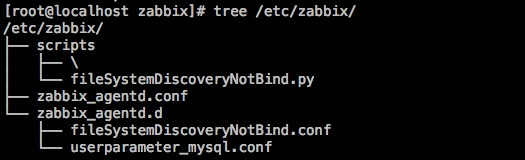
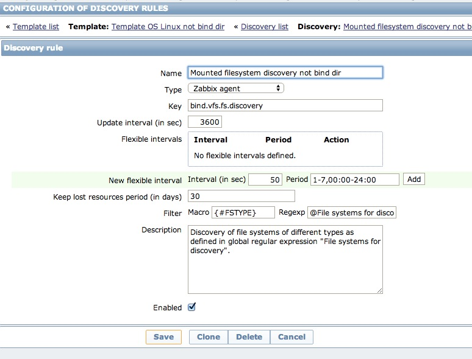
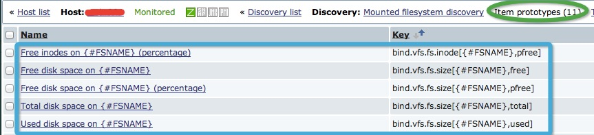
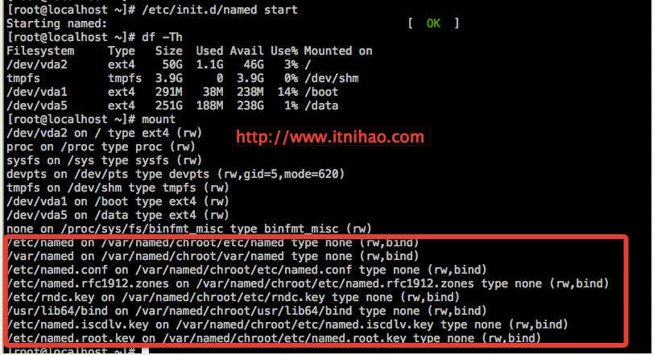
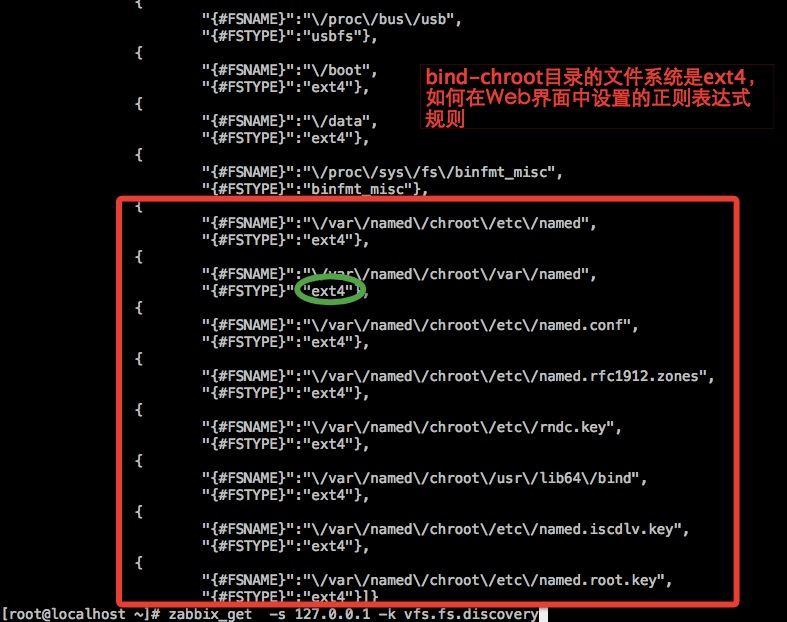
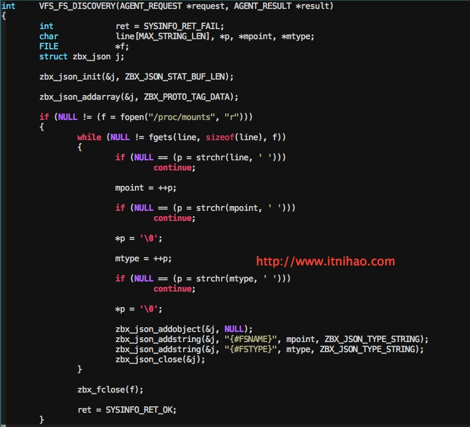
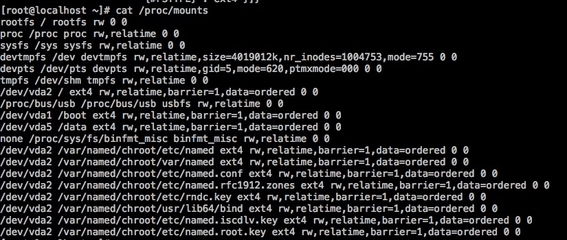

#解决的问题
  Zabbix对文件系统的监控，是通过LLD来自动添加实现的，在通过Zabbix监控bind服务器的文件系统时，当bind启用了chroot，会把chroot的目录给监控上，但这个目录是虚拟的，不具备参考意义，所以需要重新定义LLD的规则（把原先的文件系统LLD规则停用）
#用法
##1.脚本的存放位置
```
shell# tree /etc/zabbix/
/etc/zabbix/
├── scripts
│   ├── \
│   └── fileSystemDiscoveryNotBind.py     #权限775
├── zabbix_agentd.conf
└── zabbix_agentd.d
    ├── fileSystemDiscoveryNotBind.conf
    └── userparameter_mysql.conf
```
如图所示


##2.测试
# zabbix_get -s 127.0.0.1 -k bind.vfs.fs.discovery
```
{
       "data":[
              {
                     "{#FSNAME}":"/",
                     "{#FSTYPE}":"rootfs"
              },
              {
                     "{#FSNAME}":"/proc",
                     "{#FSTYPE}":"proc"
              },
              {
                     "{#FSNAME}":"/sys",
                     "{#FSTYPE}":"sysfs"
              },
              {
                     "{#FSNAME}":"/dev",
                     "{#FSTYPE}":"devtmpfs"
              },
              {
                     "{#FSNAME}":"/dev/pts",
                     "{#FSTYPE}":"devpts"
              },
              {
                     "{#FSNAME}":"/dev/shm",
                     "{#FSTYPE}":"tmpfs"
              },
              {
                     "{#FSNAME}":"/",
                     "{#FSTYPE}":"ext4"
              },
              {
                     "{#FSNAME}":"/proc/bus/usb",
                     "{#FSTYPE}":"usbfs"
              },
              {
                     "{#FSNAME}":"/boot",
                     "{#FSTYPE}":"ext4"
              },
              {
                     "{#FSNAME}":"/data",
                     "{#FSTYPE}":"ext4"
              },
              {
                     "{#FSNAME}":"/proc/sys/fs/binfmt_misc",
                     "{#FSTYPE}":"binfmt_misc"
              }
       ]
}
```
##3.导入模板
Configration-Templates-Import-选择zbx_export_templates_not_bind_dir_LLD.xml
##创建Discovery rule （模板里面已经存在）  

##创建Item prototypes （模板里面已经存在） 

###
##4.将模板Template OS Linux not bind dir链接到bind所在的主机

#现象以及原因的深度剖析
###
现在，我们有个需求，就是要去掉对bind-chroot目录的监控,即以下的目录
```
/var/named/chroot/etc/named
/var/named/chroot/var/named
/var/named/chroot/etc/named.conf
/var/named/chroot/etc/named.rfc1912.zones
/var/named/chroot/etc/rndc.key
/var/named/chroot/usr/lib64/bind
/var/named/chroot/etc/named.iscdlv.key
/var/named/chroot/etc/named.root.key
```

### 在Zabbix的Web界面，可以看到LLD添加的bind-chroot分区监控








###从代码分析
shell#vim zabbix-2.2.4/src/libs/zbxsysinfo/linux/diskspace.c
```
int     VFS_FS_DISCOVERY(AGENT_REQUEST *request, AGENT_RESULT *result)
{       
        int             ret = SYSINFO_RET_FAIL;
        char            line[MAX_STRING_LEN], *p, *mpoint, *mtype;
        FILE            *f;
        struct zbx_json j;
        zbx_json_init(&j, ZBX_JSON_STAT_BUF_LEN);
        zbx_json_addarray(&j, ZBX_PROTO_TAG_DATA);
        if (NULL != (f = fopen("/proc/mounts", "r")))
        {      
                while (NULL != fgets(line, sizeof(line), f))
                {
                        if (NULL == (p = strchr(line, ' ')))
                                continue;
                        mpoint = ++p;
                        if (NULL == (p = strchr(mpoint, ' ')))
                                continue;
                        *p = '\0';
                        mtype = ++p;
                        if (NULL == (p = strchr(mtype, ' ')))
                                continue;
                        *p = '\0';
                        zbx_json_addobject(&j, NULL);
                        zbx_json_addstring(&j, "{#FSNAME}", mpoint, ZBX_JSON_TYPE_STRING);
                        zbx_json_addstring(&j, "{#FSTYPE}", mtype, ZBX_JSON_TYPE_STRING);
                        zbx_json_close(&j);
                }
                zbx_fclose(f);
                ret = SYSINFO_RET_OK;
        }
```        




